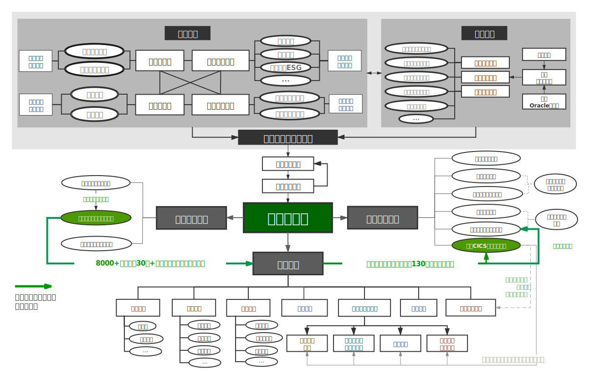

# Deloitte INsight: A Data-driven Industry Analysis Platform

Hi there! My name is Jace Yang. 
I am one of the core contributor of Deloitte INsight, an upcoming financial data product that aims to accelerate data-driven analysis in sepecific business domain. 

This repository is to show my work by pictures and my explanations. Although I am not allowed to share any code/source files in public, I can find a way to share them to you by, e.g., sharing some of my preliminary trial. Please email me at yjh.jace@gamil.com if you are interested and want more information.

## My work

Interning for 8 months since the very beginning of the product development stage, I have been trusted to take charge of the data division throughout the whole beta stage of this product.

My major contributions here:
- Prototyping the dataflow of the database.
- Building a text classification machine learning baseline.
- Developing a business analytical framework with its data dashboard.
- Designing the web page.

> Please bear with me that the language used in most files/charts is Chinese. ^ ^

### Data Pipeline

I wrote a SQL-style data processing rundown in R via 100+ tailored function based on dplyr and over 10k+ lines of code. It then helped the team to streamline the workflow and improve the efficiency remarkably.

- The whole dataflow:
    > 
    
    - Data cleaning details for 1 datatable (as an example)
        > 

- The collaboration workflow
    > 

### Business-Industry Mapping NLP Algorithm

As our team develop a 4-level market segmentation system. My algorithm is to map the company into several niche markets among 1145 different sub-industries.

The way I built the model:

### Data Dashboard
quick demo

I built several demo 

- Demo generated by Highchart:  

    > 

- Demo generated by PowerBi:  

- Inside the system:

